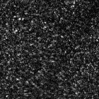
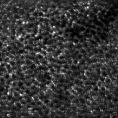
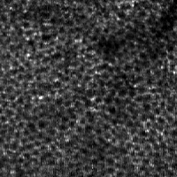

# Description

This is a TensorFlow implementation of parallel discriminator generative adversarial network (P-GAN), an artificial intelligence (AI) method  for recovering individual retinal pigment epithelial (RPE) cells from speckled adaptive optics optical coherence tomography (AO-OCT) images. 

If any portion of this code is used, please cite the following paper in your publication:

Vineeta Das, Furu Zhang, Andrew J Bower, Joanne Li, Tao Liu, Nancy Aguilera, Bruno Alvisio, Zhuolin Liu, Daniel X Hammer and Johnny Tam, "Revealing speckle obscured living human retinal cells with artificial intelligence assisted adaptive optics optical coherence tomography." *Communications Medicine* 4.1 (2024): 68.

# System Requirements

### Prerequisites

- Windows 10
- NVIDIA GPU +CUDA (tested on NVIDIA TITAN V, CUDA 11.7)

### Installation

- Install [Anaconda](https://www.anaconda.com/products/distribution)
- In the anaconda prompt:
```
conda create -n <newenv> python=3.7.13
conda activate <newenv>
cd P-GAN
pip install -r requirements.txt 
cd src
```

# File Description

- A demo test dataset has been deposited in `./data/test_data`. The folder contains eight speckled images which are input to the model (P-GAN) `(./data/test_data/input)`. 

- The ground truth images and the P-GAN recovered images are provided in `(./data/test_data/ground-truth)` and `(./data/test_data/result)`, respectively.

- The trained model weights are deposited in `./data/trained_model`.

- The python files `train_model.py` and `python test_model.py` contain the TensorFlow implementation of the training and testing pipelines for P-GAN.

- `models.py`  defines the P-GAN architecture.

# Demo

### Test

- Run `python test_model.py` to test the trained model whose weights are
  deposited in `./data/trained_model`.
- The results are stored in `./data/test_data/result`.
- The ground truth images are provided in `./data/test_data/ground-truth`.

### Train

- To train the model on custom data, run 
```
python train_model.py \
    --path-gt <path to training ground truth images> \
    --path-input <path to training input images> \
    --img-width <width of training images, default:150> \
    --img-height <height of training images, default:150> \
    --bs <batch size, default:8> \
    --epoch <number of epochs, default:100>
```

### Example

Single acquired speckled RPE image:



P-GAN recovered RPE:




Ground truth averaged RPE:



